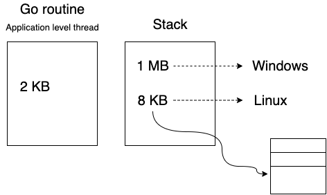
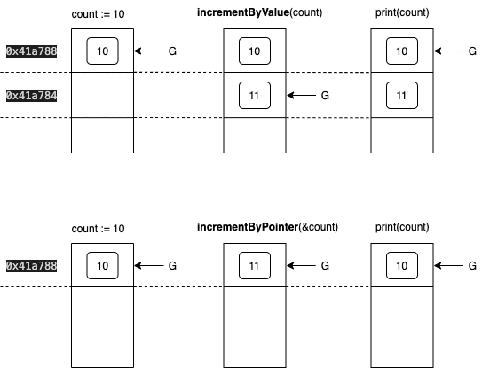

If you are new to [Go](https://golang.org/) or, like me, you started some time ago but for some reason you missed fundamentals, this post could be useful to answer why things work a certain way. I recently attended the [Go Ultimate course](https://www.ardanlabs.com/ultimate-go) imparted by [Bill Kennedy](https://twitter.com/goinggodotnet) so I will explain here what I learnt.

I have been coding in Go for the last 2 years now, so I could be wrong. I would be really happy if you could ping me in case you consider there is a mistake.

## What is Go?

Go is a statically typed, compiled, data-oriented programming language that doesn't use a virtual machine, such as is provided by the Java runtime. Go programs are compiled ahead of time to native machine code. It works on top of the hardware and it was built getting the best of other languages.

The simplicity of language often helps us, or other developers in the future, to make more efficient code. So, **_don't make code easy to do, make it easy to understand._**

## Low level

To understand how to write better code, it is important to know that the software could be affected by:

1. External latency (milliseconds).
2. Internal latency (garbage collection, sync, and orchestration) (reducing it can improve +20%, microseconds)
3. Algorithm efficiency.

### Number of processors available

On intel machines with **Hiperthread** (Intel’s name for simultaneous multithreading), the number of processors available is doubled (i.e. dual-core hyper-threaded CPU have 4 processors, quad-core non-HT CPU has 4 processors. Quad-core option is the better choice, though, because it has more physical processing hardware).
We could always check the number of processors available with `runtime.NumCPU()`. Keep in mind the [Playground](https://play.golang.org/) is a single processor machine.

### Go routine size vs stack size



When an application starts and calls `main()`, every line of code can:

1. Allocate memory
2. Read memory
3. Write memory

Bugs are (almost) always in writing memory. Every problem we solve is a data transformation issue.

## Value semantics vs pointer semantics:

### Initialising variables:

In Go there are many ways to initialise a variable:

```go
// BASIC TYPES
var count int // use this way for zero-value initialisation
count := 10   // use this way for non zero-value initialisation
count := 0    // NOT a good practise

// DEFINED TYPES
// use this way for zero-value initialisation
var u user

// use this way for non zero-value initialisation
// value semantic construction - GOOD practise
u := user{
    age: 10,
}

// pointer semantic construction - NOT a good practise
// more indicative, using the previous value semantic way
// and use '&' as many places as is needed
u := &user{
    age: 10,
}
```

[Playground](https://play.golang.org/p/-f9PCB8Y9z6)

### Functions:

This code shows the difference between sharing a variable (pointer to it) and sharing just its value:

```go
count := 10

println("count:\tValue =", count, "\tAddr =", &count)

println("-- incrementByValue(count) --")
// Pass the "value" of the variable.
incrementByValue(count)
println("----------------------")

println("count:\tValue =", count, "\tAddr =", &count)

println("-- incrementByPointer(count) --")
// Pass the "address" the variable.
incrementByPointer(&count)
println("----------------------")

println("count:\tValue =", count, "\tAddr =", &count)
```

Both ways of incrementing a variable:

```go
func incrementByValue(inc int) {
	inc++
	println("inc:\tValue =", inc, "\tAddr =", &inc)
}

func incrementByPointer(inc *int) {
	*inc++
	println("inc:\tValue =", inc, "\tAddr =", &inc)
}
```

The result of the code above is:

```text
count:	Value = 10 	Addr = 0x41a788
----- incrementByValue(count) -----
inc:	Value = 11 	Addr = 0x41a784
----------------------------------
count:	Value = 10 	Addr = 0x41a788
--- incrementByPointer(&count) ---
inc:	Value = 11 	Addr = 0x41a788
----------------------------------
count:	Value = 11 	Addr = 0x41a788
```

The `count` variable is stored in the address **0x41a788**. Its value is passed to `incrementByValue` function, who stores the incremented value in another address, 0x41a784. If this function wanted to inform of its new value it would be necessary to return it.
On the other hand, `count` address is passed to `incrementByPointer` function, who uses the same address, **0x41a788**. The result is that the original `count` variable is modified.



[Playground](https://play.golang.com/p/q0rBOyxnUDQ)

---

If you've found a typo, a sentence that could be improved or anything else that should be updated on this blog post, you can access it through a git repository and make a pull request. Instead of posting a comment, please go directly to [my GitHub repository](https://github.com/marioarranzr/dev.to) and open a new pull request with your changes.
