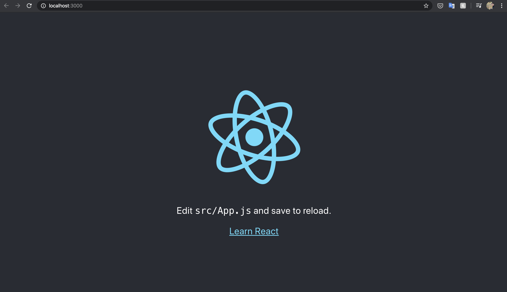
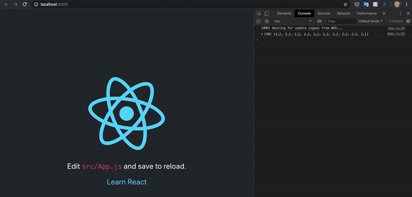
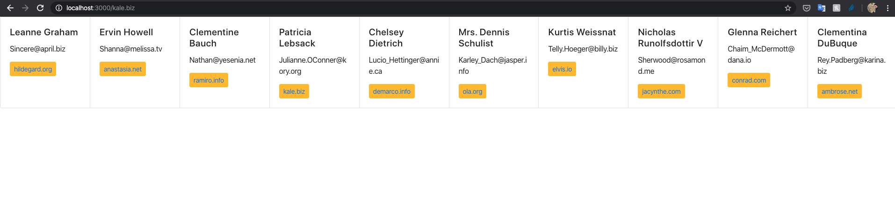

## Installing React

Let's install and use the [`create-react-app`](https://create-react-app.dev/docs/getting-started/) tool to initialise a react app with the main configuration:

```bash
npm install -g create-react-app
# We might need adding sudo at the begining
```

Create the directory we want to start working with and go into it:

```
mkdir react-bootstrap
cd react-bootstrap
```

Create the scaffolding in the directory:

```
create-react-app .
```

At this point we should have a sample react app, so we can run it locally:

```
yarn start
```



## Adding some styles

Bootstrap is the most popular CSS Framework for developing responsive and mobile-first websites, and there is a version for react that we can install:

```
yarn add react-bootstrap bootstrap
```

Finally, we need to set it in `src/index.js` by simply adding an extra import:

```js
import 'bootstrap/dist/css/bootstrap.css'
```

Now, when loading the website (run `yarn start` in case you stopped it), we will see some diferent colours changed by bootstrap.

## Try it out

After configuring the react app to use bootstrap, the next thing we can do is taking advantage of its simplicity for creating a beautiful UI without being a CSS expert.

But in order to do that, first we need fetching some data to show.

As we saw in `src/index.js`,

```js
ReactDOM.render(
  <React.StrictMode>
    <App />
  </React.StrictMode>,
  document.getElementById('root')
)
```

the website is default configured to load the `App` component. So, in this case, this is going to be the component to modify.

So far, this `App.js` is using a _functional component_, a component which doesn’t have its own state or needs to access a lifecycle hook.

```js
function App() {
  return (
      // ...
  )
}
```

To show some data in the UI, we need to have it before loading the page. An advantage of using _React components_ over _functional components_ is that we can override _lifecycle methods_. So the first change is transforming the _functional component_ into a _React component_.

```js
import React, { Component } from 'react';
// ...

class App extends Component {
    render() {
        return (
            // ...
        )
    }
}
```

At this point we can fetch the data, and to do it before the page loads completely we will override `componentDidMount()`.

```js
class App extends Component {
  componentDidMount() {
    fetch('http://jsonplaceholder.typicode.com/users')
    .then(res => res.json())
    .then((data) => {
      this.setState({ contacts: data })
      console.log(this.state.contacts)
    })
    .catch(console.log)
  }

  render() {
    return (
      // ...
    )
  }
}
```

Thanks to `console.log()`, when we reload the website while having the developer tools opened, we can see the fetched result.



Finally, we structure the data the way we want. For this example I've used [bootstrap cards](https://react-bootstrap.netlify.com/components/cards/#cards):

```js
import React, { Component, Fragment } from 'react'
import { Card, Button } from 'react-bootstrap'

class App extends Component {
  componentDidMount() {
    // ...
  }

  render() {
    return (
      <Fragment>
        <CardGroup>
          {this.state.contacts.map((contact, idx) => (
            <Card key={idx}>
              <Card.Body>
                <Card.Title>{contact.name}</Card.Title>
                <Card.Text>{contact.email}</Card.Text>
                <Button variant="warning" size="sm">
                  <a href={'https://' + contact.website} target="_blank" rel="noopener noreferrer">
                    {contact.website}
                  </a>
                </Button>
              </Card.Body>
            </Card>
          ))}
        </CardGroup>
      </Fragment>
    )
  }
}
```



[**Github source code**](https://github.com/marioarranzr/react-bootstrap/tree/v1)

---

# Found a typo?

If you've found a typo, a sentence that could be improved or anything else that should be updated on this blog post, you can access it through a git repository and make a pull request. Instead of posting a comment, please go directly to [my GitHub repository](https://github.com/marioarranzr/dev.to) and open a new pull request with your changes.
